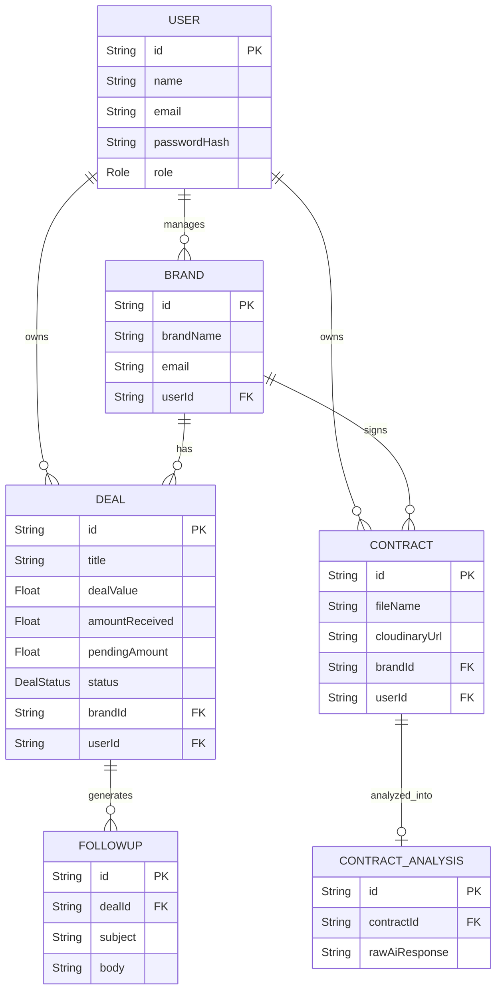

# Database Documentation

The platform utilizes a PostgreSQL database. Below is the structural representation of the primary models and their relational intersections.

## Entity Relationship Summary

- **User**: The primary tenant (`ATHLETE`, `BRAND_REPRESENTATIVE`, or `ADMIN`).
- **Brand**: Owned by a `User`. Represents a sponsoring company.
- **Deal**: Owned by a `User` and tied to a `Brand`. Represents a specific sponsorship negotiation or active campaign.
- **Contract**: Owned by a `User` and tied to a `Brand`. Represents a secure uploaded document (PDF/DOCX).
- **ContractAnalysis**: A 1-to-1 relationship with `Contract`, storing AI extracted JSON metadata.
- **FollowUp**: A 1-to-many relationship with `Deal`. Stores the history of generated payment follow-ups.

## ER Diagram

## Table Descriptions

### `User`
Stores athlete or admin accounts. Passwords are encrypted via bcrypt. Serves as the core isolation layer (Row-Level logic proxy) ensuring users only see their own data.

### `Brand`
A rolodex entry for a sponsor. Stores contact emails, names, and industry descriptions.

### `Deal`
The core business entity tracking a sponsorship pipeline. Features precise financial fields (`dealValue`, `amountReceived`, `pendingAmount`) used by the Analytics dashboard and Follow-Up generators.

### `Contract`
A Vault entry for legal documents. Stores critical Cloudinary metadata (`cloudinaryUrl`, `cloudinaryPublicId`) to allow for rendering and secure deletion.

### `ContractAnalysis`
Stores the results of the OpenAI document parsing. Includes specific extracted strings like `deliverables`, `paymentTerms`, and the `rawAiResponse`.

### `FollowUp`
Stores the exact drafted email (subject, body) for historical tracking when attempting to collect a pending payment on a Deal.
